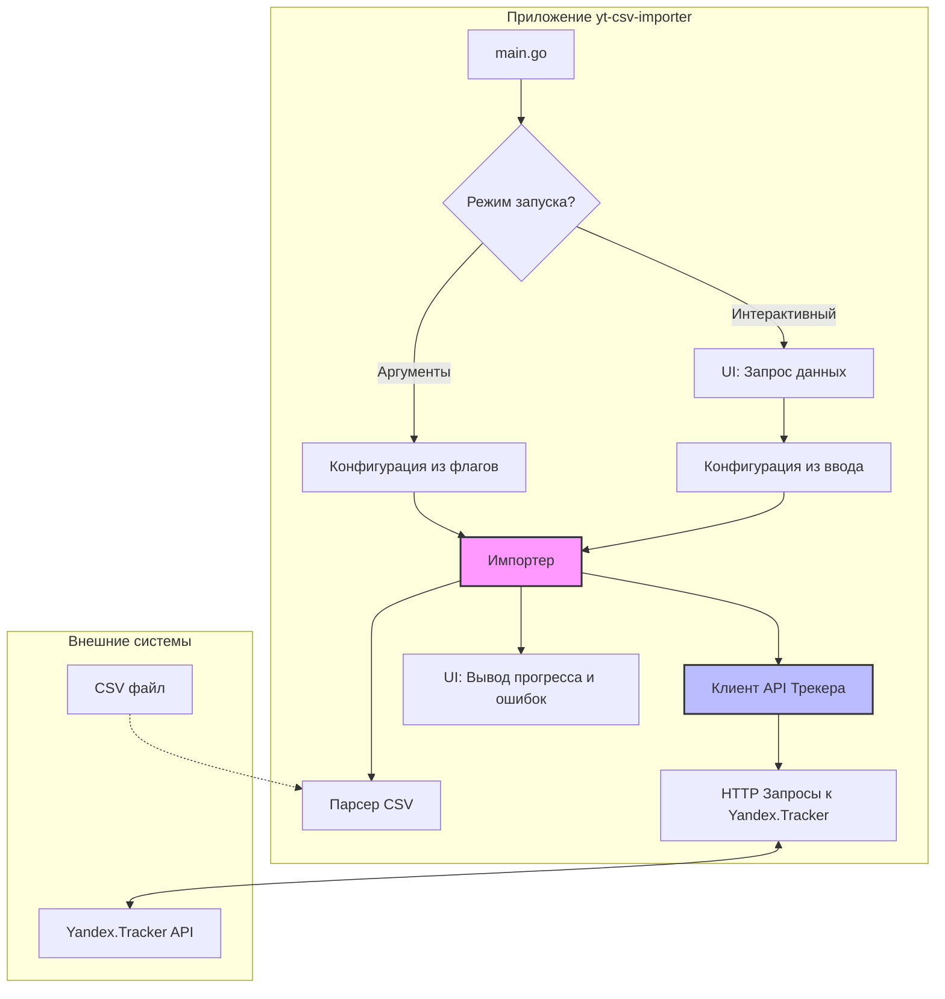

# PRD: Консольная утилита для импорта задач в Яндекс.Трекер (yt-csv-importer)

## 1. Executive Summary & Goals

Этот документ описывает требования к продукту (PRD) и архитектурный план для создания консольной утилиты `yt-csv-importer`. Утилита предназначена для автоматизации процесса создания задач в Яндекс.Трекере путем импорта данных из CSV-файла.

-   **Основная цель:** Создать надежный и удобный инструмент на языке Go для пакетного импорта задач из CSV-файла в указанную очередь Яндекс.Трекера.
-   **Ключевые задачи:**
    1.  Реализовать парсинг CSV-файлов определенного формата.
    2.  Обеспечить взаимодействие с Yandex.Tracker API для поиска и создания задач и эпиков.
    3.  Предоставить два режима работы: через аргументы командной строки и интерактивный.
    4.  Обеспечить качественную обратную связь и обработку ошибок для пользователя.

## 2. Current Situation Analysis

Проект создается с нуля. Существующей кодовой базы или системы нет. Анализ основан на предоставленной документации к API Яндекс.Трекера и требованиях пользователя.

## 3. Proposed Solution / Refactoring Strategy

### 3.1. High-Level Design / Architectural Overview

Предлагается модульная архитектура, которая разделяет приложение на логические компоненты с четко определенными обязанностями. Это обеспечит хорошую тестируемость, поддерживаемость и возможность будущего расширения.

Основные компоненты:
1.  **Точка входа (`main`)**: Обработка флагов командной строки, запуск нужного режима (CLI/интерактивный).
2.  **Конфигурация (`config`)**: Сбор и хранение конфигурации (токен, ID организации, очередь, путь к файлу).
3.  **UI (`ui`)**: Взаимодействие с пользователем в интерактивном режиме и вывод информации (логи, ошибки, прогресс).
4.  **Парсер CSV (`csvparser`)**: Чтение и разбор входного CSV-файла.
5.  **Клиент API (`tracker`)**: Инкапсуляция всей логики взаимодействия с API Яндекс.Трекера.
6.  **Импортер (`importer`)**: Ядро приложения, координирующее работу парсера и API клиента для выполнения импорта.



### 3.2. Key Components / Modules

-   **`cmd/yt-csv-importer/main.go`**:
    -   **Ответственность**: Инициализация приложения. Определение и парсинг флагов командной строки (`cobra` или `flag`). Выбор между пакетным и интерактивным режимом.
-   **`internal/config`**:
    -   **Ответственность**: Определение структуры конфигурации (`Config`). Загрузка конфигурации из флагов, переменных окружения или интерактивного ввода. Валидация конфигурации.
-   **`internal/ui`**:
    -   **Ответственность**: Реализация интерактивных промптов для сбора конфигурации (с помощью библиотеки `survey`). Форматированный вывод логов, сообщений об ошибках и отчетов о результатах импорта.
-   **`internal/csvparser`**:
    -   **Ответственность**: Открытие и чтение CSV-файла. Парсинг строк в соответствии с форматом `Эпик,Заголовок,Описание`. Предоставление итератора или канала для чтения записей по одной.
-   **`internal/tracker`**:
    -   **Ответственность**: Полная инкапсуляция логики работы с API Яндекс.Трекера. Формирование HTTP-запросов, добавление заголовков авторизации (`Authorization: Bearer`, `X-Cloud-Org-ID`), обработка ответов и ошибок API. Предоставление методов: `FindEpic(name string)`, `CreateEpic(name, queue string)`, `CreateIssue(issueData Issue)`.
-   **`internal/importer`**:
    -   **Ответственность**: Основная бизнес-логика.
        1.  Получает конфигурацию.
        2.  Использует `csvparser` для чтения записей.
        3.  Для каждой записи:
            -   Если указан эпик, использует `tracker` для поиска.
            -   Использует внутренний кэш для ID эпиков, чтобы избежать повторных запросов.
            -   Если эпик не найден, использует `tracker` для его создания.
            -   Использует `tracker` для создания задачи с нужными параметрами (заголовок, описание, родительский эпик).
        4.  Собирает статистику по успешно созданным и проваленным задачам.
        5.  Передает результаты в `ui` для отображения.

### 3.3. Detailed Action Plan / Phases

#### Phase 1: Foundation & API Client Shell
-   **Objective(s):** Создать структуру проекта, настроить зависимости, реализовать базовую конфигурацию и каркас API клиента.
-   **Priority:** High

-   **Task 1.1:** Инициализация Go-модуля и структуры проекта.
    -   **Rationale/Goal:** Создать основу для дальнейшей разработки.
    -   **Estimated Effort (Optional):** S
    -   **Deliverable/Criteria for Completion:** Создана структура каталогов (`cmd`, `internal/config`, `internal/tracker` и т.д.). Выполнена команда `go mod init github.com/user/yt-csv-importer`.

-   **Task 1.2:** Добавление зависимостей.
    -   **Rationale/Goal:** Подключить внешние библиотеки для CLI и UI.
    -   **Estimated Effort (Optional):** S
    -   **Deliverable/Criteria for Completion:** В `go.mod` добавлены библиотеки, например `github.com/spf13/cobra` для CLI и `github.com/AlecAivazis/survey/v2` для интерактивного режима.

-   **Task 1.3:** Реализация модуля `config`.
    -   **Rationale/Goal:** Создать структуру для хранения конфигурации и логику ее загрузки из флагов.
    -   **Estimated Effort (Optional):** M
    -   **Deliverable/Criteria for Completion:** Структура `Config` определена. Функция `LoadFromFlags` реализована.

-   **Task 1.4:** Создание каркаса API клиента в пакете `tracker`.
    -   **Rationale/Goal:** Определить интерфейс для взаимодействия с API Трекера.
    -   **Estimated Effort (Optional):** M
    -   **Deliverable/Criteria for Completion:** Создан файл `tracker/client.go` со структурой `Client` и заглушками методов: `NewClient(token, orgID string)`, `FindEpic(...)`, `CreateIssue(...)`.

#### Phase 2: Core API Interaction
-   **Objective(s):** Реализовать полную функциональность клиента для API Яндекс.Трекера.
-   **Priority:** High

-   **Task 2.1:** Реализация метода `CreateIssue` в API клиенте.
    -   **Rationale/Goal:** Обеспечить возможность программного создания задач и эпиков.
    -   **Estimated Effort (Optional):** M
    -   **Deliverable/Criteria for Completion:** Метод отправляет `POST /v3/issues/` с корректным телом запроса и заголовками. Обрабатывает успешные ответы и ошибки API.

-   **Task 2.2:** Реализация метода `FindEpic` в API клиенте.
    -   **Rationale/Goal:** Обеспечить поиск существующих эпиков по названию.
    -   **Estimated Effort (Optional):** M
    -   **Deliverable/Criteria for Completion:** Метод отправляет `POST /v3/issues/_search` с фильтром по `summary` и `type: "epic"`. Корректно парсит ответ и возвращает ID эпика или `nil`, если не найден.

#### Phase 3: CSV Processing & Import Logic
-   **Objective(s):** Реализовать чтение CSV и основную логику импорта.
-   **Priority:** Medium

-   **Task 3.1:** Реализация пакета `csvparser`.
    -   **Rationale/Goal:** Обеспечить чтение и парсинг входного файла.
    -   **Estimated Effort (Optional):** M
    -   **Deliverable/Criteria for Completion:** Функция `Parse(filePath string)` возвращает канал или слайс со структурами, представляющими строки CSV. Обрабатываются ошибки чтения файла и парсинга.

-   **Task 3.2:** Реализация пакета `importer`.
    -   **Rationale/Goal:** Связать парсер и API клиент, реализовать кэширование эпиков.
    -   **Estimated Effort (Optional):** L
    -   **Deliverable/Criteria for Completion:** Структура `Importer` с методом `Run()` реализована. Метод итерируется по записям из `csvparser`, использует `tracker.Client` для поиска/создания эпиков и создания задач. Реализован `map[string]string` для кэширования `epicName -> epicID`.

#### Phase 4: User Interface & Finalization
-   **Objective(s):** Завершить приложение, добавив интерактивный режим, документацию и обработку ошибок.
-   **Priority:** Medium

-   **Task 4.1:** Реализация интерактивного режима в `main.go` и `ui`.
    -   **Rationale/Goal:** Сделать утилиту удобной для использования без аргументов командной строки.
    -   **Estimated Effort (Optional):** M
    -   **Deliverable/Criteria for Completion:** Если флаги не переданы, пользователю задаются вопросы для ввода токена, ID организации, пути к файлу и очереди.

-   **Task 4.2:** Улучшение обработки ошибок и логирования.
    -   **Rationale/Goal:** Предоставить пользователю понятную обратную связь.
    -   **Estimated Effort (Optional):** M
    -   **Deliverable/Criteria for Completion:** Все ошибки (ошибки сети, API, парсинга) перехватываются и выводятся в читаемом виде. В конце работы выводится отчет: "Создано задач: X, с ошибками: Y".

-   **Task 4.3:** Создание файла `README.md`.
    -   **Rationale/Goal:** Документировать использование утилиты.
    -   **Estimated Effort (Optional):** S
    -   **Deliverable/Criteria for Completion:** Файл `README.md` создан и содержит описание утилиты, формата CSV, параметров запуска (CLI и интерактивный режим) и примеры использования.

-   **Task 4.4:** Создание файла `.gitignore`.
    -   **Rationale/Goal:** Исключить из репозитория бинарные файлы и временные артефакты.
    -   **Estimated Effort (Optional):** S
    -   **Deliverable/Criteria for Completion:** Файл `.gitignore` создан со стандартными для Go-проектов правилами.

### 3.4. Data Model Changes

Будут созданы следующие внутренние структуры данных:

```go
// internal/config/config.go
type Config struct {
    Token      string
    OrgID      string
    Queue      string
    FilePath   string
}

// internal/csvparser/record.go
type Record struct {
    Epic        string // Необязательно
    Summary     string // Обязательно
    Description string // Необязательно
}

// internal/tracker/models.go
// Структура для создания задачи через API
type CreateIssueRequest struct {
    Summary     string      `json:"summary"`
    Queue       interface{} `json:"queue"` // может быть string (ключ) или object
    Parent      interface{} `json:"parent,omitempty"` // может быть string (ключ) или object
    Description string      `json:"description,omitempty"`
    Type        interface{} `json:"type,omitempty"` // для создания эпика
}

// Структура для ответа от API при создании задачи
type IssueResponse struct {
    ID  string `json:"id"`
    Key string `json:"key"`
}
```

### 3.5. API Design / Interface Changes

Интерфейс внутреннего пакета `tracker` будет выглядеть следующим образом:

```go
// internal/tracker/client.go
package tracker

// Client для работы с API Yandex.Tracker
type Client struct {
    // ... http.Client, token, orgID, baseURL
}

// NewClient создает нового клиента
func NewClient(token, orgID string) (*Client, error)

// FindEpic ищет эпик по имени в указанной очереди.
// Возвращает ID эпика или пустую строку, если не найден.
func (c *Client) FindEpic(name, queue string) (string, error)

// CreateIssue создает задачу или эпик.
// Для эпика в issueData.Type нужно передать "epic".
func (c *Client) CreateIssue(issueData CreateIssueRequest) (*IssueResponse, error)
```

## 4. Key Considerations & Risk Mitigation

### 4.1. Technical Risks & Challenges

-   **Rate Limiting API**: API Яндекс.Трекера может иметь ограничения на количество запросов в единицу времени.
    -   **Mitigation**: Внедрить настраиваемую задержку между API-вызовами. В логах выводить информацию о коде ответа `429 Too Many Requests` и предлагать пользователю увеличить задержку.
-   **Обработка больших CSV-файлов**: Файлы с десятками тысяч строк могут потреблять много памяти и приводить к большому количеству API-запросов.
    -   **Mitigation**: Использовать потоковое чтение CSV, а не загружать весь файл в память. Реализовать graceful shutdown (по Ctrl+C), чтобы не прерывать процесс в середине создания задачи.
-   **Неконсистентность данных**: Эпик может быть создан, но создание связанной с ним задачи может провалиться.
    -   **Mitigation**: Вести детальный лог операций. В конце выводить список задач, которые не удалось создать, с указанием строки в CSV и причины ошибки.

### 4.2. Dependencies

-   **Внешние**: Доступность и стабильность API Яндекс.Трекера.
-   **Внутренние**: Задачи внутри фаз зависят друг от друга. Фазы должны выполняться последовательно.

### 4.3. Non-Functional Requirements (NFRs) Addressed

-   **Usability (Удобство использования)**: Два режима работы (CLI и интерактивный) делают утилиту гибкой. Читаемые сообщения об ошибках и финальный отчет улучшают пользовательский опыт.
-   **Reliability (Надежность)**: Атомарность операций не гарантируется API, но утилита должна быть устойчива к сбоям отдельных операций, логировать их и продолжать работу. Кэширование ID эпиков повышает надежность и скорость, уменьшая количество запросов.
-   **Security (Безопасность)**: IAM-токен является чувствительной информацией. Рекомендуется передавать его через аргумент командной строки, интерактивный ввод (который не отображается в истории команд) или переменные окружения, но не хранить в конфигурационных файлах.
-   **Maintainability (Поддерживаемость)**: Модульная архитектура с разделением ответственности упрощает внесение изменений и исправление ошибок.

## 5. Success Metrics / Validation Criteria

-   Утилита успешно импортирует 100% валидных записей из тестового CSV-файла.
-   Для записей с ошибками (например, без заголовка) утилита выводит понятное сообщение об ошибке, указывает номер строки и продолжает работу.
-   Интерактивный режим корректно собирает все необходимые параметры.
-   При указании существующего эпика новый не создается, а используется найденный.
-   При указании несуществующего эпика он успешно создается.

## 6. Assumptions Made

-   Пользователь имеет необходимые права в Яндекс.Трекере для создания задач и эпиков в указанной очереди.
-   Пользователь может получить IAM-токен и ID своей организации.
-   Входной CSV-файл имеет кодировку UTF-8.
-   Формат CSV строго соответствует `Эпик(необязательно),Заголовок задачи,Описание задачи(необязательно)`. Наличие заголовка в CSV-файле не предполагается, парсинг начинается с первой строки. Если заголовок есть, его нужно будет удалить вручную.
-   Тип создаваемых задач - "Задача" (`task`), а эпиков - "Эпик" (`epic`). Эти типы существуют в указанной очереди.

## 7. Open Questions / Areas for Further Investigation

-   Нужно ли поддерживать CSV-файлы с заголовком? (Предполагается, что нет, но стоит уточнить).
-   Какое поведение ожидается, если в CSV найден эпик, но в Трекере существует несколько эпиков с таким же названием? (Текущий план: брать первый найденный).
-   Каковы точные лимиты API Яндекс.Трекера? (Нужно исследовать или предусмотреть настраиваемую задержку).
-   Нужно ли добавлять поддержку других полей задачи (например, `Исполнитель`, `Приоритет`) в будущем? (Архитектура должна это позволять).